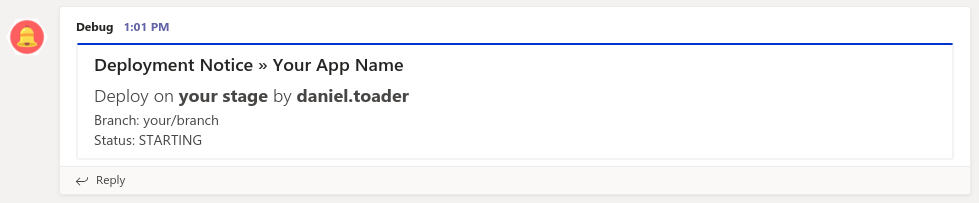
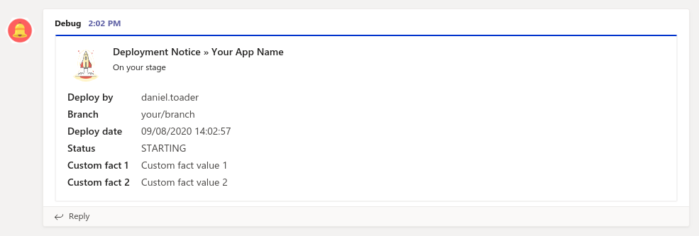

# Capistrano::Teams

[](https://rubygems.org/gems/capistrano-teams)
[](https://github.com/danieltoader/capistrano-teams/blob/master/LICENSE.md)
[](https://github.com/danieltoader/capistrano-teams/blob/master/CHANGELOG.md)
[](https://rubygems.org/gems/capistrano-teams)
[](http://travis-ci.org/danieltoader/capistrano-teams)
[](https://ci.appveyor.com/project/danieltoader/capistrano-teams)
[](https://coveralls.io/r/danieltoader/capistrano-teams?branch=master)

This gem extends Capistrano functionality to push notices to Microsoft Teams via an incoming webhook.

With just the webhook url configured and the default values, the plugin registers hooks for the base 
deploy tasks (start, revert, finish, rollback and failed) and pushes simple notifications to the room
where the used webhook was created.

This project is meant to be highly customisable, you can find all the details below.

This gem works with Capistrano v3.x+. Please check the capistrano gem version you're using before 
installing this gem:
```shell script
 bundle show | grep capistrano
```
If you are new to Capistrano, check the [Capistrano 3 documentation](http://capistranorb.com/).

## Installation
Add this line to your application's Gemfile:
```ruby
gem 'capistrano', '~> 3.0.0'
gem 'capistrano-teams'
```

And then execute:
```shell script
bundle install
```

Or install it manually:
```shell script
gem install capistrano-teams
```

## Usage
In Microsoft Teams, add an "Incoming Webhook" connector in the channel where you want to 
see deployment notices as described [here](https://docs.microsoft.com/en-us/microsoftteams/platform/webhooks-and-connectors/how-to/add-incoming-webhook). 
Copy the generated Webhook URL since you will need to add it in one of the detailed steps below.

### Setup your application
Add the following line to your `Capfile`.
```ruby
require "capistrano/teams"
```

In order to send notifications you must set the following options in your `deploy.rb` or 
stage file (staging.rb, production.rb, etc). The only required option is the `:teams_webhook_url` setting. 

```ruby
set :teams_webhook_url, "https://outlook.office.com/webhook/{groupId}@{tenantId}/IncomingWebhook/{connectorId}/{webHookId}"

set :teams_suppress_events, false
set :teams_content_mode, Message::TYPE_CARD
set :teams_http_options, verify_mode: OpenSSL::SSL::VERIFY_PEER 
```

To disable sending notifications for a certain stage, or to change the team/channel/room the message is 
posted to, you need to edit the stage file and set the following:
```ruby
set :teams_suppress_events, true # Default value: false
```

#### Automated notifications
After setting the minimum options needed for your application, the plugin will push notifications to 
the teams room where the webhook was created for all the deploy events. Listed below you can see the
hooks where the plugin injects itself:
```ruby
namespace :deploy do
  before 'deploy:starting', 'teams:deploy:starting'
  before 'deploy:reverting', 'teams:deploy:reverting'
  after 'deploy:finishing', 'teams:deploy:finishing'
  after 'deploy:finishing_rollback', 'teams:deploy:finishing_rollback'
  after 'deploy:failed', 'teams:deploy:failed'
end
```

#### Custom notifications
If you want to send a custom notification you can invoke or execute the rake task `teams:notify` as shown below

```ruby
# with invoke
Rake::Task["teams:notify"].invoke(
  "{status}", 
  [
    {"name"=>"{first_fact_name}", "value"=>"{first_fact_value}"},
    {"name"=>"{second_fact_name}", "value"=>"{second_fact_value}"},
    # ...    
  ],
  "{theme_color}"
)
# with execute
Rake::Task["teams:notify"].execute(
  Rake::TaskArguments.new(
    [:status, :facts, :theme_color],
    [
      "{status}",
      [
        {"name"=>"{first_fact_name}", "value"=>"{first_fact_value}"},
        {"name"=>"{second_fact_name}", "value"=>"{second_fact_value}"},
        # ...    
      ],
      "{theme_color}"
    ]
  )
)
```

#### Remove default hooks for an action
To remove a default hook from this plugin you can use the following line, it can be used
anywhere in the desired `deploy.rb` or stage file
```ruby
Rake::Task['deploy:starting'].prerequisites.delete('teams:deploy:starting')
```

#### Custom Hook for rake task with arguments
If you want to create a custom hook for tasks with arguments you can use the snippet below
(with both invoke and execute shown above):
```ruby
before 'deploy:starting', :only => :deploy do
  Rake::Task["teams:notify"].invoke(
    "{status}", 
    [
      {"name"=>"{first_fact_name}", "value"=>"{first_fact_value}"},
      {"name"=>"{second_fact_name}", "value"=>"{second_fact_value}"},
      # ...    
    ],
    "{theme_color}"
  )
end
```


#### Message Types
You can use this plugin with two message types: `Message::TYPE_BASIC` or `Message::TYPE_CARD`

##### Basic message type (default)

The basic message type is the simple way to send notifications from capistrano to Teams.

```ruby
set :teams_basic_message_title, 'Deployment Notice » %<application>s'
set :teams_basic_message_text, '<h1>Deploy for %<application>s' \
      ' on <strong>%<stage>s</strong> by ' \
      '<strong>%<user>s</strong></h1> ' \
      "Branch: %<branch>s \n\n" \
      'Status: %<status>s'
```

##### Card message type

The card message type has a few more options and can be configured more and can list several facts (name => value)


```ruby
set :teams_card_message_title, 'Deployment Notice » %<application>s'
set :teams_card_message_sub_title, 'On %<stage>s'
set :teams_card_message_image, ''
set :teams_card_message_summary, 'Deploy for %<application>s on %<stage>s by %<user>s'
set :teams_card_message_markdown, true
```
#### Configurable options

##### Available options and default values
```ruby
set :teams_webhook_url, "https://outlook.office.com/webhook/{groupId}@{tenantId}/IncomingWebhook/{connectorId}/{webHookId}"

set :teams_suppress_events, false # Default value: false
set :teams_content_mode, Message::TYPE_BASIC # Message::TYPE_BASIC or Message::TYPE_CARD
set :teams_http_options, verify_mode: OpenSSL::SSL::VERIFY_PEER # Default verify mode

# Theme colors
set :teams_starting_color, '0000FF' # Default color: blue
set :teams_reverting_color, 'FFFF00' # Default color: yellow
set :teams_finishing_color, '00FF00' # Default color: green
set :teams_rollback_color, 'FFFF00' # Default color: yellow
set :teams_failed_color, 'FF0000' # Default color: red

# Statuses
set :teams_starting_status, 'STARTING'
set :teams_reverting_status, 'REVERTING'
set :teams_finishing_status, 'FINISHED'
set :teams_rollback_status, 'ROLLBACK'
set :teams_failed_status, 'FAILED'

# Used for Message::TYPE_BASIC
set :teams_basic_message_title, 'Deployment Notice » %<application>s'
set :teams_basic_message_text, '<h1>Deploy for %<application>s' \
      ' on <strong>%<stage>s</strong> by ' \
      '<strong>%<user>s</strong></h1> ' \
      "Branch: %<branch>s \n\n" \
      'Status: %<status>s'

# Used for Message::TYPE_CARD
set :teams_card_message_title, 'Deployment Notice » %<application>s'
set :teams_card_message_sub_title, 'On %<stage>s'
set :teams_card_message_image, ''
set :teams_card_message_summary, 'Deploy for %<application>s on %<stage>s by %<user>s'
set :teams_card_message_markdown, false # Enable markdown inside message

# Default values
set :teams_default_color, '333333' # Default color: grey
set :teams_default_status, 'UNKNOWN'
set :teams_default_application, 'N/A'
set :teams_default_branch, 'N/A'
set :teams_default_stage, 'N/A'
set :teams_default_user, 'UNKNOWN'
```

## Development
After checking out the repo, run `bin/setup` to install dependencies. Then, run `rake spec` to run the 
tests. You can also run `bin/console` for an interactive prompt that will allow you to experiment.

To install this gem onto your local machine, run `bundle exec rake install`. To release a new version, 
update the version number in `version.rb`, and then run `bundle exec rake release`, which will create 
a git tag for the version, push git commits and tags, and push the `.gem` file to [rubygems.org](https://rubygems.org).

## Deployment
Run deploy
```shell script
cap <stage_name> deploy
```

You should then be able to proceed as you would usually, you may want to familiarise yourself 
with the truncated list of tasks, you can get a full list with:
```shell script
cap -T
```
    
## Contributing
1. Fork it
2. Create your feature branch (`git checkout -b my-new-feature`)
3. Commit your changes (`git commit -am 'Add some feature'`)
4. Push to the branch (`git push origin my-new-feature`)
5. Create new Pull Request

If something is not working for you, or you find a bug, please report it.
Bug reports and pull requests are welcome on GitHub at https://github.com/danieltoader/capistrano-teams. 

## License
The gem is available as open source under the terms of the [MIT License](https://github.com/danieltoader/capistrano-teams/blob/master/LICENSE.md).

## Code of Conduct
Everyone interacting in the Capistrano::Teams project's codebase, issue trackers, chat rooms and mailing 
lists is expected to follow the [code of conduct](https://github.com/danieltoader/capistrano-teams/blob/master/CODE_OF_CONDUCT.md).

## Todo's
[] Add tests
[] Add functionality for sending "potentialAction" key for the card message type
